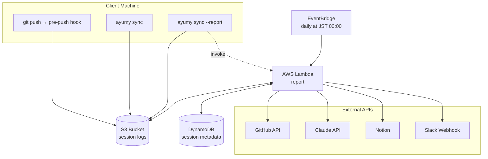

# Ayumy
*Traces of daily craft, woven by AI*

GitHub 上の日次開発アクティビティ（Commit, PR, Issue）と Claude Code のセッションログを自動収集し、Claude API で自然言語の要約を生成して Notion データベースに記録するシステム

セットアップ方法は [Setup.md](./docs/Setup.md)、基本的な使い方は [Manual.md](./docs/Manual.md) を参照

## Architecture
S3 + DynamoDB + AWS Lambda を使用した2フェーズ構成



## Tech Stack
| 技術 | 用途 |
|---|---|
| AWS Lambda | レポート生成の実行環境 |
| AWS S3 | セッションログの保管 |
| Amazon DynamoDB | セッションメタデータの集約 |
| Amazon EventBridge Scheduler | 日次の定期実行 |
| Python 3.12 | メインスクリプト（`requests`, `anthropic`, `PyGithub`） |
| GitHub API (REST) | 開発アクティビティの取得 |
| Anthropic API (`claude-sonnet-4-20250514`) | 自然言語による要約生成 |
| Notion API | 作業記録の書き込み |
| Slack Incoming Webhook | 完了通知 |

## Directory Structure
```
ayumy/
├── bin/ayumy           # CLI エントリポイント
├── scripts/            # セッション転送・hook 設置スクリプト
├── hooks/pre-push      # 各リポジトリにシンボリックリンクで配置
├── lambda/             # Lambda ハンドラとメインパッケージ
├── template.yaml       # AWS SAM テンプレート
└── docs/               # 仕様・セットアップ・運用ガイド
```

## Running Cost
Anthropic API と AWS の費用が発生する（GitHub API・Notion API は無料枠内）

| 項目 | コスト |
|---|---|
| Anthropic API | ~$1.5/月 |
| AWS（Lambda, S3, Secrets Manager 等） | ~$0.5/月 |

※ 平均的な開発日の見積もり。セッションログが大量にある日はトークン数が増加する
