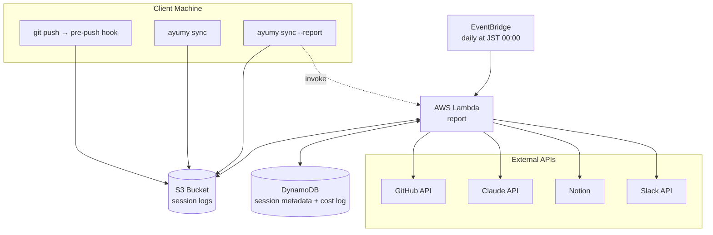

# Ayumy
*Traces of daily craft, woven by AI*

<p align="center">
  <picture>
    <source media="(prefers-color-scheme: dark)" srcset="docs/assets/logo-dark.png">
    
  </picture>
</p>

Ayumy は全自動開発ログシステムです。あなたの GitHub 上の開発アクティビティ (Commit, PR, Issue) と Claude Code の session ログを元に、Claude API で日次レポートを生成して Notion データベースに記録します

<div align="center">

🛠️ [Setup - セットアップ方法](./docs/Setup.md) | 📖 [Manual - 基本的な使い方](./docs/Manual.md)

</div>

## 🏗️ Architecture
- S3 + DynamoDB + AWS Lambda を使用した 2 段階構成です
- クライアント側システムは macOS のみサポートしています



## 🧰 Tech Stack
| Technology | Purpose |
|---|---|
| AWS Lambda | レポート生成の実行環境 |
| AWS S3 | session ログの保管 |
| Amazon DynamoDB | session メタデータと Claude API コスト履歴の集約 |
| Amazon EventBridge Scheduler | 日次の定期実行 |
| Python | メインスクリプト |
| GitHub API (REST) | 開発アクティビティの取得 |
| Claude API | 自然言語による要約生成 |
| Notion API | 作業記録の書き込み |
| Slack Web API | 完了通知 |

## 📁 Directory Structure
```
ayumy/
├── bin/ayumy           # CLI entrypoint
├── scripts/            # session 転送・hook 設置スクリプト
├── hooks/pre-push      # 各リポジトリにシンボリックリンクで配置
├── lambda/             # Lambda ハンドラとメインパッケージ
├── template.yaml       # AWS SAM テンプレート
└── docs/               # 仕様・セットアップ・運用ガイド
```

## 💰 Running Cost
Ayumy の稼働にあたっては Claude API と AWS のコストが発生します

| Item | Cost |
|---|---|
| Claude API | ~$1.5/月 |
| AWS (Lambda, S3, Secrets Manager etc.) | ~$0.5/月 |

- GitHub API・Notion API は無料枠内で概ね収まります
- 上記は平均的な利用における見積もりであり、消費トークンの増減によりコストが変動します

## ⚖️ License
- 本リポジトリのコードは [MIT License](LICENSE) で公開しています
- ただし、ロゴ画像 `docs/assets/logo-*.png` は MIT License の対象外とし、[Setup.md](docs/Setup.md) の手順で使う場合を除き、@n-yU の許可なく使用できません
