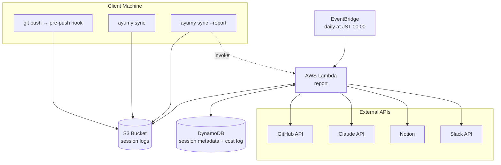

# Spec
Ayumy の全要件を記す。アーキテクチャ・データフロー・外部 API 連携・Notion DB スキーマ・コスト見積もりを含む

- [Overview](#overview)
- [Goals](#goals)
- [System Components](#system-components)
  - [Architecture](#architecture)
  - [External Services and APIs](#external-services-and-apis)
  - [Directory Structure](#directory-structure)
- [Phase 1: Session Log Transfer](#phase-1-session-log-transfer)
  - [Phase 1 Overview](#phase-1-overview)
  - [Data Source](#data-source)
  - [Transfer Script](#transfer-script)
  - [Pre-push Hook](#pre-push-hook)
  - [Manual Sync](#manual-sync)
  - [Security Notes](#security-notes)
- [Phase 2: Data Integration, Summarization, and Notion Writing](#phase-2-data-integration-summarization-and-notion-writing)
  - [GitHub Activity Fetch](#github-activity-fetch)
  - [Session Log Read](#session-log-read)
  - [Session Write to DynamoDB](#session-write-to-dynamodb)
  - [Summary Generation](#summary-generation)
  - [Cost Execution Log Persistence](#cost-execution-log-persistence)
  - [Slack Notification](#slack-notification)
  - [Processed JSONL Cleanup](#processed-jsonl-cleanup)
- [Notion Database Specification](#notion-database-specification)
  - [Database Properties](#database-properties)
  - [Page Body](#page-body)
  - [Tag Classification](#tag-classification)
- [AWS Lambda Configuration](#aws-lambda-configuration)
  - [Lambda Execution Modes](#lambda-execution-modes)
  - [Environment Variables](#environment-variables)
  - [Lambda Function Configuration](#lambda-function-configuration)
  - [Deployment](#deployment)
- [Operational Considerations](#operational-considerations)
  - [Network Requirements](#network-requirements)
  - [API Rate Limits](#api-rate-limits)
  - [Error Handling](#error-handling)
  - [Running Cost](#running-cost)
  - [Storage Management](#storage-management)
- [Future Extensions](#future-extensions)

## Overview
GitHub 上の日次開発アクティビティ（Commit, Pull Request, Issue）と Claude Code での会話記録を自動収集し、Claude API で自然言語の要約を生成したうえで、Notion データベースに記録するシステム。対象リポジトリは S3 上のセッションログから特定する

## Goals
- 日々の開発作業を自動的に記録・蓄積する
- Claude Code での思考・意思決定の過程も含めて記録する
- 自然言語の要約により、振り返りや共有が容易な形で残す
- 手動の日報作成を不要にする

## System Components
### Architecture
本システムは2フェーズで構成される。セッションログは S3 バケットに保管し、レポート生成は AWS Lambda で実行する。セッションメタデータは DynamoDB に集約する



S3 上のオブジェクトキー構造は [Directory Structure](#directory-structure)、DynamoDB テーブル設計は [Session Write to DynamoDB](#session-write-to-dynamodb) を参照

### External Services and APIs
| Service | Purpose | Authentication |
|---|---|---|
| GitHub API (REST) | アクティビティデータの取得 | Fine-grained PAT |
| Anthropic API | 自然言語による要約生成 | API Key |
| Notion API | 作業記録の書き込み | Internal Integration Token |
| Slack Web API | 完了通知 | Bot User OAuth Token |
| AWS S3 | セッションログの保管 | AWS 認証情報（IAM ユーザー / プロファイル） |
| Amazon DynamoDB | セッションメタデータの集約 | IAM ロール |
| AWS Lambda | レポート生成の実行環境 | IAM ロール |
| Amazon EventBridge Scheduler | 日次の定期実行 | — |

### Directory Structure
**ayumy リポジトリ（GitHub）** — スクリプトと設定のみ。セッションデータは含まない

```
ayumy/
├── bin/ayumy           # CLI エントリポイント
├── scripts/            # セッション転送・hook 設置スクリプト
├── hooks/pre-push      # 各リポジトリにシンボリックリンクで配置
├── lambda/
│   ├── handler.py      # Lambda ハンドラ
│   ├── config/         # チューニング定数の YAML と loader
│   └── report/         # メインパッケージ
├── template.yaml       # AWS SAM テンプレート
├── docs/
└── README.md
```

**S3 バケット**

```
s3://{bucket}/
└── claude-sessions/                  # クライアントマシンから転送された JSONL（DynamoDB 書き込み後に削除）
    ├── {project-name}/
    │   └── {session-id}.jsonl
    └── ...
```

実行ログは CloudWatch Logs に出力する

## Phase 1: Session Log Transfer
### Phase 1 Overview
Claude Code セッションの JSONL を S3 バケットに転送する。クライアント側のスクリプト（`scripts/`, `hooks/`, `bin/ayumy`）は macOS のみサポートする

- **自動転送（pre-push hook）**: push を契機に、当該プロジェクトの未同期セッションを同期転送。失敗時は push を中止する
- **手動転送（`ayumy sync`）**: push せずに作業を中断する場合など、任意のタイミングで実行
- **手動転送＋レポート生成（`ayumy sync --report`）**: S3 への転送後に Lambda を呼び出してレポート生成まで実行

いずれも共通の転送スクリプト [scripts/sync_session.sh](../scripts/sync_session.sh) を使用する。`--report` 指定時は転送完了後に `aws lambda invoke` で Lambda 関数を呼び出す

### Data Source
Claude Code は会話を `~/.claude/projects/` 以下にローカル保存している

- 各プロジェクトがディレクトリとして存在（パスのスラッシュがダッシュに置換された名前）
- 個別セッションは JSONL ファイル（`{session-id}.jsonl`）として保存
- メタデータ（セッション ID、タイムスタンプ、ブランチ等）は JSONL の各エントリに埋め込まれている
- 外部インデックスファイルは存在しない

JSONL の各エントリは Claude Code が生成するデータの観測に基づく構造を持つ（公式仕様は存在しない）

<details>
<summary>JSONL Entry Fields</summary>

| Field | Type | Description |
|---|---|---|
| `type` | String | エントリ種別（`"user"`, `"assistant"`, `"summary"` 等） |
| `timestamp` | String | ISO 8601 形式のタイムスタンプ（例: `"2026-03-28T10:00:00+09:00"`）。常に存在するが、不正な値は観測されていない |
| `cwd` | String | エントリ発生時の作業ディレクトリ絶対パス。`type=user` / `type=assistant` の各エントリに付与される。session 抽出時に project の作業ディレクトリの根拠として用い、Bash tool_use 内の `cd` による cross-repo 判定の基準にする（[Session Write to DynamoDB](#session-write-to-dynamodb)） |
| `message.content` | String / List | 文字列またはブロックのリスト。`type=user` は通常文字列だが `tool_result` を含むリストの場合もある |

`type=assistant` の `message.content` リスト内のブロック

| Field | Type | Description |
|---|---|---|
| `type` | String | ブロック種別（`"text"`, `"tool_use"` 等） |
| `name` | String | `type=tool_use` の場合のツール名 |
| `id` | String | `type=tool_use` の識別子。後続の `type=user` ブロックの `tool_use_id` から参照され、tool_use と tool_result を突き合わせる |
| `input.command` | String | `name="Bash"` の場合の実行コマンド文字列。冒頭の `cd <path>` を解釈して per-tool_use の effective cwd を求める（[Session Write to DynamoDB](#session-write-to-dynamodb)） |

`type=user` の `message.content` がリストの場合のブロック

| Field | Type | Description |
|---|---|---|
| `type` | String | ブロック種別（`"tool_result"` 等） |
| `tool_use_id` | String | 対応する assistant の `tool_use.id`。cross-repo 判定で対応する tool_use の effective cwd を引くために使う（[Session Write to DynamoDB](#session-write-to-dynamodb)） |
| `content` | String | ツール実行結果のテキスト |
| `is_error` | Boolean | エラー結果かどうか |

`tool_result` の `content` に `[... <short-sha>] <message>` 形式の行が含まれる場合、git commit の実行結果として SHA とコミットメッセージを抽出する

- 1つの `tool_result` に複数のコミット行が含まれる場合は全て抽出する
- pre-commit hook の出力が先行する場合にも対応する（行単位でパターンを検索）
- 通常の `[branch sha]` 形式に加え、`[branch (root-commit) sha]` や `[detached HEAD sha]` にも対応する
- これにより squash merge で GitHub API から取得できないコミットを補完する

</details>

Claude Code が生成するため、タイムスタンプのフォーマットは安定しており、パース時に防御的な例外処理（`ValueError` の catch 等）は行わない

転送対象のセッションは、マーカーファイル（`.ayumy_last_sync`）との mtime 比較で決定する

- マーカーが存在しない場合（初回）は全 JSONL を対象とする
- スキャン前に一時マーカー（`.ayumy_last_sync.tmp`）を作成し、転送成功後に `mv` で本マーカーに昇格させる
- これにより、転送中に更新されたファイルが次回検出漏れしないようにする

### Transfer Script
hook と手動実行の両方から呼ばれる共通スクリプト

```
sync_session.sh [--project <project-name>] [--all] [--report] [--date DATE]
```

| Option | Behavior |
|---|---|
| `--project <name>` | 指定プロジェクトの差分セッションのみ転送。`<name>` は `~/.claude/projects/` 以下のディレクトリ名（例: `-Users-username-Documents-github-repo`） |
| `--all` | 全プロジェクトから差分セッションを一括転送 |
| `--report` | S3 転送後に Lambda 関数を呼び出してレポート生成を実行 |
| `--date DATE` | 指定日または日付範囲のレポートを生成・再生成（`--report` 必須）。`YYYY-MM-DD` または `YYYY-MM-DD..YYYY-MM-DD` 形式 |
| 引数なし | カレントディレクトリに対応するプロジェクトを自動判定 |

要件

- **環境変数 `AYUMY_S3_BUCKET`**: セッションログの保管先 S3 バケット名
- **AWS 認証情報**: AWS CLI が使用可能な状態であること（`~/.aws/credentials` または環境変数）
- **冪等性**: `aws s3 cp` による上書きで同じ JSONL の複数回転送でも問題ない

### Pre-push Hook
`ayumy/hooks/pre-push` として管理し、各リポジトリの `.git/hooks/pre-push` にシンボリックリンクで配置する

hook はリポジトリパスからプロジェクト名を解決し、`sync_session.sh --project {name}` をフォアグラウンドで呼び出すラッパーである

- 転送に失敗した場合は非ゼロ終了で push を中止する。これにより AWS 認証切れなど upload 不能な状態を push 時点で顕在化させる
- 当該リポジトリに対応する Claude session が存在しない（`~/.claude/projects/` 配下にディレクトリが無い）場合は何もせず exit 0 とし、push を通す

hook の配布方法（`ayumy setup-hooks` コマンドで設置）

- **コマンド設置**: 対象リポジトリで `ayumy setup-hooks` を実行
- **手動設置**: 対象リポジトリで `ln -s {AYUMY_REPO}/hooks/pre-push "$(git rev-parse --git-path hooks)/pre-push"` を実行

`ayumy setup-hooks` は過去に同コマンドが作成した旧 `post-commit` symlink（`readlink` の target が `ayumy/hooks/post-commit` の絶対パスと一致するもの）の除去も担当する。手動 `ln` で別パス表記により設置された legacy hook は対象外で、ユーザー側で削除する必要がある

設置先は Git に hook の参照先を問い合わせて決めるため、通常のリポジトリに加えて worktree やサブモジュールでも同じ手順で設置できる。worktree で実行した場合は共通ディレクトリに設置され、同じリポジトリのすべての worktree に効く

### Manual Sync
push せずに作業を中断する場合や、hook で転送されなかったセッションを補完する

```bash
ayumy sync                                                      # current directory のプロジェクトを同期
ayumy sync --all                                                # 全プロジェクトの未同期分を一括同期
ayumy sync --project -Users-username-Documents-github-my-project # 特定プロジェクトを指定
ayumy sync --report                                             # 同期後にレポート生成（Lambda 実行）まで行う
ayumy sync --all --report                                       # 全プロジェクト同期 + レポート生成
ayumy sync --report --date 2026-03-25                           # 指定日のレポートを生成・再生成
ayumy sync --report --date 2026-03-01..2026-03-05               # 日付範囲のレポートを一括生成
```

`ayumy sync` は [bin/ayumy](../bin/ayumy) CLI を通じて [scripts/sync_session.sh](../scripts/sync_session.sh) を呼び出す。CLI はサブコマンドをディスパッチするエントリポイントであり、クライアントマシンのセットアップ時に PATH に追加する（例: `export PATH="$HOME/ayumy/bin:$PATH"`）。手動実行時はフォアグラウンドで実行し、転送結果を標準出力に表示する。`--report` 指定時は Lambda の実行結果も標準出力に表示する

### Security Notes
- JSONL には会話の生データが含まれるため、会話中やツール実行時に機密情報（API キー、パスワード等）をログに残さないよう注意する
- S3 バケットはパブリックアクセスブロックを有効化し、IAM ポリシーで自アカウントのみにアクセスを制限する
- S3 のサーバーサイド暗号化（SSE-S3）を有効化する
- 必要に応じて特定プロジェクトを除外するフィルタリング機能を設ける

## Phase 2: Data Integration, Summarization, and Notion Writing
### GitHub Activity Fetch
対象期間は実行方式によって異なる

| Execution Mode | Range |
|---|---|
| 定期実行（EventBridge） | 前日 JST 00:00:00 〜 当日 JST 00:00:00 |
| 手動実行（`ayumy sync --report`） | 当日 JST 00:00:00 〜 現在時刻 |
| 日付指定（`ayumy sync --report --date DATE`） | 指定日 JST 00:00:00 〜 翌日 JST 00:00:00（各日付ごと） |

- Lambda event の `source` フィールドで実行方式を判定する（`"manual"` → 手動、それ以外 → 定期）
- `target_date` フィールドが指定されている場合は `source` に関わらずその日付の全日範囲を対象とする
- `target_date` は `YYYY-MM-DD` または `YYYY-MM-DD..YYYY-MM-DD` 形式。範囲指定時は各日付に対して順にレポートを生成する
- `target_date` 指定時は backfill（未レポート日の自動検出）をスキップし、指定された日付のみを処理する

対象リポジトリは S3 上のセッションログから特定する。各プロジェクトディレクトリの `.ayumy_repo` メタデータファイルからリポジトリ名を読み取り、そのリポジトリのみ `GET /repos/{owner}/{repo}` で取得する

| Activity | Endpoint | Filter |
|---|---|---|
| Commits | `GET /search/commits` | `repo:{full_name} author-date:{since_date}..{until_date}` |
| Pull Requests | `GET /repos/{owner}/{repo}/pulls` | `state=all`, `sort=updated`, 前日以降 |
| Issues | `GET /repos/{owner}/{repo}/issues` | `since`, `state=all`, PR を除外 |

Commits は Search Commits API を使用する。GitHub Search の date 比較は UTC 解釈であり JST 1 日分が連続する 2 つの UTC 日付にまたがるため、検索範囲を JST 境界より広く取り、取得後にタイムゾーン対応の `since <= author_date < until` で絞り込む。これにより手動実行時の部分日（当日 00:00 〜 現在時刻）にも対応する。squash merge で `author-date` が書き換えられた commit は検出できないため、セッション JSONL の `tool_result` から抽出した commit 情報で補完する（[Session Write to DynamoDB](#session-write-to-dynamodb) 参照）

各 commit には紐づく PR 番号も付与する。Notion Timeline で commit を親 PR ブロック配下にネストする際の参照キーとして利用するほか、Hybrid 経路の PR 取得（[Hybrid Backfill Fetch](#hybrid-backfill-fetch)）でも再利用する

Search API の secondary rate limit に対応するため、一定時間ウィンドウ内でのリクエスト数を制御する throttle 処理を行う

#### Hybrid Backfill Fetch
PR/Issue の `updated_at` 経路は対象日以降に状態が更新されると `updated_at` がウィンドウから外れて取得対象から漏れる。例えば T 日に open された PR が T+1 日に merge された場合、T 日の再生成では PR が取得できず Timeline に PR ブロックが現れない

通常運用（前日定期実行・手動当日実行）では影響軽微なため `updated_at` 経路を維持する。`target_date` 指定時、または `scan_backfill_dates` で検出された未レポート日に対しては Hybrid 経路に切り替える

| Activity | Fetch Path |
|---|---|
| Pull Requests | `GET /search/issues` を `is:pr` + `created:`/`merged:`/`closed:` のレンジクエリで3回呼び出し、状態遷移した PR を取得する。さらに `fetch_commits` で各コミットに付与済みの関連 PR 番号を再利用し、対象日にコミットだけがあった PR も補足する。これに DynamoDB の `session_pulls`（[Session Write to DynamoDB](#session-write-to-dynamodb)）を加えて PR 番号で union し、各番号を `GET /repos/{owner}/{repo}/pulls/{N}` で個別取得する |
| Issues | `GET /search/issues` を `is:issue` + `created:`/`closed:` のレンジクエリで2回呼び出し、状態遷移した Issue を取得する。これに DynamoDB の `session_issues`（[Session Write to DynamoDB](#session-write-to-dynamodb)）を加えて Issue 番号で union する。session 由来の番号のみで Search に含まれないものは `GET /repos/{owner}/{repo}/issues/{N}` で個別取得し、PR を返した場合（`pull_request` 属性が設定）は除外する |

Search クエリの日付範囲は UTC/JST の境界ずれを吸収するため広めに取り、取得後に `created_at` / `merged_at` / `closed_at` のいずれかが `[since, until)` に入るものへ絞り込む。commit 由来 PR は対象日にコミットが存在する事実、session 由来 PR/Issue は session で対象日に touch された事実をもって採用するため、いずれもこの絞り込みの対象外とする。削除済み PR/Issue は 404 となるためスキップする

Hybrid 経路の Search 呼び出しは commit 取得の Search 呼び出しと共通の throttle で管理する

### Session Log Read
DynamoDB の `ayumy-sessions` テーブルから対象日付をパーティションキーとして Query し、セッションメタデータを取得する。結果をリポジトリ別にグルーピングし、各リポジトリ内のセッションを `start_time` 順にソートする

バックフィル検出は DynamoDB の Scan で行う。`reported_at` が未設定、または `updated_at > reported_at` のアイテムが存在する過去日付を対象とする（最大3日分）。セッションが更新された場合は `updated_at` が `reported_at` を超えるため、自動的に再生成対象となる

### Session Write to DynamoDB
レポート生成の前処理として、S3 上の未アーカイブ JSONL をパースし、セッションメタデータを DynamoDB に書き込む。日付フィルタなしで全エントリを処理し、JST 日付ごとにグルーピングする

テーブル名は `ayumy-sessions`、オンデマンドモードかつ PITR 有効

<details>
<summary>DynamoDB Table Schema</summary>

| Key | Attribute | Type | Description |
|---|---|---|---|
| PK | `date` | String | JST 日付（`YYYY-MM-DD`） |
| SK | `repo#session_id` | String | リポジトリ名 + セッション ID |
| | `repo` | String | リポジトリ名 |
| | `project` | String | プロジェクトディレクトリ名 |
| | `start_time` | String | ISO 8601 |
| | `end_time` | String | ISO 8601 |
| | `user_messages` | List | ユーザーメッセージ |
| | `tools_used` | List | 使用ツール |
| | `session_commits` | List | セッション中の git commit 結果（`[{sha, message, timestamp}]`、未検出時は空リスト） |
| | `session_pulls` | List | session 中の Bash tool 操作で言及された PR 番号のソート済みリスト（未検出時は空リスト） |
| | `session_issues` | List | session 中の Bash tool 操作で言及された Issue 番号のソート済みリスト（未検出時は空リスト） |
| | `updated_at` | String | ISO 8601、書き込み・更新時刻 |
| | `reported_at` | String | ISO 8601、レポート生成時刻（未生成時は未設定） |

</details>

書き込み時の動作

- 同一キー（PK + SK）のアイテムは上書きされる（冪等性を担保）
- ユーザーメッセージも `session_commits` もないグループはスキップする
- リポジトリ名は `.ayumy_repo` メタデータファイルから解決する。メタデータがないプロジェクトはスキップする
- assistant の Bash tool_use のコマンドから PR/Issue 番号を抽出する。`gh` / `git` の引数として PR/Issue を明示的に操作した箇所のみが対象で、本文中で言及されただけの URL や `#番号` はノイズとなるため対象外とする。`git` 由来の番号は PR/Issue の種別を判別できないため両方の候補として保持し fetch 側で振り分ける（[Hybrid Backfill Fetch](#hybrid-backfill-fetch)）
- 抽出は project の作業ディレクトリ内で実行されたコマンドのみを対象とする。Bash tool の冒頭で `cd <他 repo path> && ...` により別ディレクトリへ移動した場合、そのコマンド由来の commit / PR / Issue 番号は除外する。`cd` のパス指定が解決できない形式（別ユーザーの `~user/...` 等）も project 外として扱う
- 書き込み成功後、処理した JSONL を S3 から削除する。書き込み失敗時は S3 を削除せず、次回実行時に再試行する。書き込み失敗時も DynamoDB に前回成功分のデータが残っているため、レポート生成フローは継続する

レポート生成後の動作

- 対象日付の全アイテムの `reported_at` を現在時刻に更新する
- これにより `scan_backfill_dates` が同じ日を再検出しなくなる

### Summary Generation
使用モデル: `claude-sonnet-4-6`

GitHub アクティビティと Claude Code セッションログの両方をコンテキストとして渡し、リポジトリごとの要約を生成する。GitHub アクティビティは Notion 本文と同じ対象日基準で絞り、対象日に完了していないアイテムを完了として渡さない。文体は常体で統一し、ですます調は使用しない

- **リポジトリ別の要点**: 各リポジトリで行われた作業の要点を 2〜5 項目の箇条書きで記述する。最初の項目はそのリポジトリの最重要の要点として単独でも通じる内容にする（Slack 通知ではこの項目を 1 文サマリとして流用する）
- **Claude Code での作業**: 上記の要点の中に Claude Code セッションでの相談・実装方針の検討内容も含めて構わない
- PR/Issue のステータス別一覧と時系列のイベントは Notion 本文の生成時にプログラムで組み立てるため、Claude API の出力には含めない

番号と識別子の書き方はシステムプロンプト（[lambda/report/prompts/summary_system.txt](../lambda/report/prompts/summary_system.txt)）で指定し、そちらを single source of truth とする。装飾として使わせる記法は [Page Body の Summary](#summary) が解釈するものに揃える

出力がルールから外れた場合の後処理は設けない。種別の前置を機械的に削ると「その PR #155 では」のような自然な文まで削ることになり、表示が冗長になる程度の実害と釣り合わない

<details>
<summary>Summary Prompt Format</summary>

```
以下は {日付} の GitHub アクティビティおよび Claude Code での作業記録です。
日本語で簡潔に要約してください。

---
# GitHub アクティビティ
## {リポジトリ名}
### Commits
- {コミットメッセージ}
### Pull Requests
- [merged] #12 機能Aの追加
### Issues
- [closed] #8 バグ修正

---
# Claude Code セッション
## プロジェクト: {project-name}
### セッション 1 (14:00 - 15:30)
- ユーザー: 認証機能のリファクタリングについて相談
- ツール使用: ファイル編集 (auth.ts, middleware.ts)
```

</details>

出力にはリポジトリごとの作業要点（箇条書き）とタグの提案を含める

session ログはあるが GitHub アクティビティが対象日に存在しないリポジトリ（以下 session-only）は Claude API 入力から除外する。Notion ページを作成しない現状仕様（[Database Properties](#database-properties)）で捨てられる要約分の API コスト発生を抑えるため

- 判定は session 由来 commit を GitHub アクティビティにマージした後の状態で行う
- 対象日の全リポジトリが session-only の場合は Claude API 呼び出し自体を skip し、コスト記録も残さない
- session-only 発生時は Slack 通知に反映する（[Slack Notification](#slack-notification)）
- session store 側の "reported" スタンプは通常通り打つ。翌日以降 push で追いつけば `updated_at > reported_at` の backfill 判定でレポート生成が再走する

Claude API の応答構造が想定を逸脱した場合、要約生成は原因を含む `ValueError` を投げ、[Classification Policy](#classification-policy) に沿って当該日のレポート生成を失敗させる。自動再試行は挟まず、運用者が `ayumy sync --report` で明示的に再実行する。検証範囲は必須項目と型に限定する

### Slack Notification
Notion への書き込み完了後、Slack Web API の `chat.postMessage` で指定チャンネルに通知を送信する。通知が失敗しても処理全体は正常終了とする（通知はベストエフォート）

#### Notification Content
- Notion ページへのリンク（リポジトリごとに 1 行）。Claude API が生成した summary 箇条書きの先頭項目がある場合は 1 文サマリとしてリンクの後ろに付加する。Notion 側と同じ記法（[Page Body の Summary](#summary)）を解釈して mrkdwn に変換し、Slack の特殊記法を無効化するエスケープを済ませてから置き換える
- 実行メトリクス: ayumy バージョン、経過時間（Lambda 実行時は timeout との比率）、ピークメモリ（Lambda 実行時は memory limit との比率）
- Claude API コスト: 今回の実行の利用金額、当月累計・前月同期間比、当月の Claude API 呼び出し回数・前月同期間比。実行メトリクスと同じ context block に統合して 1 行で表示する。前月データが無く比率を計算できない項目は `(MoM ...)` 部分を丸ごと省略する（永続化された履歴の詳細は [Cost Execution Log Persistence](#cost-execution-log-persistence)）

アクティビティが 0 件で Notion ページが作成されなかった場合は、正常稼働を示す簡易通知を送信する。処理中にエラーが発生した場合もエラー内容を通知する

session-only の扱い（[Summary Generation](#summary-generation)）に応じて表示を分ける

- 対象日の全リポジトリが session-only の場合は session-only 専用の簡易通知を送る
- 部分的 session-only の場合は通常の Daily Report 通知の下部に session-only リポジトリ名を context として付記する

#### Run Origin Labels
Daily Report のヘッダー末尾には実行の由来を示すラベルを付ける。手動実行では `[manual]`、未報告日の補完では `[backfill]` を並べ、両方に該当する場合は `[manual] [backfill]` となる。定期実行で補完対象でない日を処理した場合は無印とし、通常運用時の見た目を変えない

- Daily Report のヘッダーを持つ通知すべてに同じ規則で付ける
- `[backfill]` は GitHub の取得経路を切り替える判定（[Hybrid Backfill Fetch](#hybrid-backfill-fetch)）をそのまま流用する。日付を明示指定した手動実行は指定日すべてが補完扱いとなるため、当日を指定した場合も付く
- ヘッダーは代替テキストにも流用されるため、プッシュ通知のプレビュー段階でも由来を判別できる

#### Message Splitting
日付範囲を指定した一括実行では日数分の通知が 1 メッセージに積み上がるため、Slack の 1 メッセージあたりのブロック数上限を超える場合は複数のメッセージに分けて channel に連投する

- 分割は日単位の境界でのみ行い、1 日分の通知が 2 つのメッセージにまたがらないようにする
- 実行メトリクスは最後のメッセージに載る
- Block Kit を解釈しないクライアント向けの代替テキストも同じ切れ目で分割する

#### Warning Thread
Classification Policy で warning に分類した失敗は 1 run 単位で集約クラスに蓄積し、上記の親メッセージ送信後にその最後のメッセージの `ts` を `thread_ts` として thread 返信として投稿する。運用者は CloudWatch の `logger.warning` 出力に加え、Slack の thread でも警告を把握できる

- 集約は明示的な `add()` 呼び出しで行い、logging.Handler 経由の自動収集はしない（第三者ライブラリの warning 混入を避けるため）
- `add()` 内部で `logger.warning` を発火するため、各呼び出し箇所は 1 行で CloudWatch と aggregator の両方に届く
- 発生元は限定的な値しか取らないため `StrEnum` で集約し、表記揺れを防ぐ
- thread 投稿の本文は発生元ごとにグルーピングし、各 entry の件名と関連識別子（commit SHA、PR 番号、S3 key 等）を Block Kit で構造化する
- 集約 warning が 0 件の run では thread 投稿しない
- thread 投稿がブロック数上限を超える場合は複数の返信に分割する
- thread 投稿の失敗は親通知の成功を壊さないよう独立して suppress する（ベストエフォート方針を継承）

### Cost Execution Log Persistence
Claude API 呼び出しのコスト管理として、要約生成のたびに 1 実行 = 1 record を DynamoDB に永続化する

テーブル名は `ayumy-costs`、オンデマンドモードかつ PITR 有効

<details>
<summary>DynamoDB Table Schema</summary>

| Key | Attribute | Type | Description |
|---|---|---|---|
| PK | `year_month` | String | 実行時刻の JST 月（`YYYY-MM`）、月次 Query の効率化用 |
| SK | `sk` | String | `<実行 JST date>#<executed_at>` 形式で日時順に並ぶ |
| | `target_date` | String | 対象レポート日（JST `YYYY-MM-DD`） |
| | `executed_at` | String | ISO 8601 UTC、Lambda 実行時刻 |
| | `model` | String | 実行時の Claude モデル ID |
| | `input_usd_per_1m_tokens` | Number | 実行時の入力単価 |
| | `output_usd_per_1m_tokens` | Number | 実行時の出力単価 |
| | `input_tokens` | Number | 入力トークン数 |
| | `output_tokens` | Number | 出力トークン数 |
| | `spend_usd` | Number | 単価 × トークン数を実行時に計算した USD |

</details>

`year_month` と SK の日付部分は **実行時刻の JST** を基準に決まる（対象レポート日ではない）。理由は backfill 実行のコストも「支払いが発生した実行月」に含めることで、Anthropic の請求サイクルと Slack 表示（当月累計）を一致させるため

書き込みは generate_summary 成功時に PutItem で全 attribute を 1 度書き込む。1 行 = 1 回の Claude API 呼び出しに対応するため、Slack に表示する月次「Claude API 呼び出し回数」は当月・前月同期間の行数をそのまま集計すればよい

`model` と単価を行ごとに保持することで、期中でモデル差し替えや pricing 改定が起きても実行時点の値を遡って再解釈しない。過去分は無期限に保持し、TTL は設定しない

Slack 通知に表示する月次メトリクスは、当月・前月同期間の各行を Query で取得したうえでアプリケーション側で集計する（DynamoDB は SUM / COUNT 相当の集計関数を提供しないため）

### Processed JSONL Cleanup
DynamoDB への書き込みが正常に完了した後、処理した JSONL ファイルを S3 から削除する。削除対象は `ingest` で処理したオブジェクトキーに限定し、処理中に到着した遅延ファイルが誤って削除されるのを防ぐ。セッションデータは DynamoDB に永続化されているため、JSONL の保持は不要

## Notion Database Specification
### Database Properties
Date × Repository 単位でページを作成する。1日に複数ページが生成される。再実行時は対象日の既存ページをアーカイブ（soft-delete）してから再作成し、冪等性を担保する。GitHub activity に存在しないリポジトリは Notion ページを作成しない

| Property | Type | Description | Example |
|---|---|---|---|
| Name | Title | 日付とリポジトリ名 | `26-03-01: ayumy` |
| Date | Date | 対象日 | `2025-03-01` |
| Repository | Select | リポジトリ名 | `ayumy` |
| Tags | Multi-select | 作業内容の分類タグ | `feature`, `refactor` |
| Commits | Number | 対象日のコミット数 | `5` |
| Merged | Number | 対象日にマージした PR 数 | `2` |
| Closed | Number | 対象日にクローズした Issue 数 | `1` |
| Sessions | Number | リポジトリのセッション数 | `3` |
| Version | Text | レポート生成時の ayumy バージョン | `0.2.0` |

ページには絵文字ではなく Notion 組み込みのアイコンを設定し、データベースの一覧でリポジトリを見分けられるようにする。アイコンと色はリポジトリごとに [lambda/config/config.yml](../lambda/config/config.yml) の `notion` セクションで指定し、エントリの無いリポジトリには既定のアイコンを当てる。名前は Notion のアイコンピッカー上の表示名を受け付け、実在しない名前は API がエラーを返す

### Page Body
Notion ページの本文は Summary、ステータス別セクション、Timeline で構成する。Summary は Claude API が生成し、それ以外は GitHub アクティビティから決定論的に組み立てる。ブロックタイプは `heading_2` と `bulleted_list_item` を使い分け、Timeline では `bulleted_list_item` の `children` フィールドで PR 配下の commit をネストする

```
[heading_2]            Summary
[bulleted_list_item]   リポジトリの作業要点（2〜5項目）
[heading_2]            Done（該当がある場合のみ）
[bulleted_list_item]   対象日に完了した PR や Issue
[heading_2]            In Progress（該当がある場合のみ）
[bulleted_list_item]   作業中の PR や Issue（draft PR を含む）
[heading_2]            TODO（該当がある場合のみ）
[bulleted_list_item]   対象日に新規作成された Issue（バックログ）
[heading_2]            Timeline（該当がある場合のみ）
[bulleted_list_item]   PR ブロック親 + 配下 commit を `children` でネスト、merge commit / 直接 commit / Issue open / close / unmerged PR close を最上位に時系列で interleave
```

GitHub アイテムへのリンクは PR / Issue が `#xx: Title`、commit が `{sha-prefix}: {commit message}` の形式とし、それぞれ GitHub URL でリンク化する。ページはリポジトリ単位で作られ、リポジトリ名は Repository プロパティと Name タイトルに出るため、本文の各行では省く

#### Summary
各項目は Claude が生成した文字列をそのまま載せず、インラインコード・太字・番号参照の 3 種の記法を解釈して rich_text に展開する。記法は先頭から順に切り出して入れ子にせず、ある記法の内側に書かれた記号は解釈せずそのまま残す。番号参照はリポジトリ名を伴わなければページのリポジトリ、伴えばそのリポジトリへリンクし、表示するテキストは書かれたまま残す

上記以外の記法は記号のまま表示される。書かせない側の担保は [Summary Generation](#summary-generation) の生成ルールに持たせる

#### Status Sections
ステータスは取得時点の state ではなく、完了時刻（PR は merge、マージされず close された PR と Issue は close）が対象日ウィンドウ内かで振り分ける。対象日より前に完了したアイテムは、セッション内での言及や close 後の更新で取得対象に入っただけであるためいずれのセクションにも載せない

- Done: 対象日に完了した PR / Issue
- In Progress: 対象日終了時点で未完了の PR（draft 含む）、対象日より前に作成された未完了 Issue
- TODO: 対象日に新規作成され、対象日終了時点で未完了の Issue

Done セクションの各項目には状態を示す prefix を付ける。通常完了したものには `✅ `、イレギュラーな完了には `⚠️ (理由) ` を付け、後者は以下を区別する

- マージされず close された PR: `⚠️ (closed) `
- `not_planned` で close された Issue: `⚠️ (not planned) `
- `duplicate` で close された Issue: `⚠️ (duplicate) `

#### Timeline
Timeline は `bulleted_list_item` のネスト構造で表現する。PR 親エントリは進行中・merged を問わず `🔀 #xx: Title` の形式で表示し、その PR に紐づく非 merge commit を `children` フィールドにネストする。merge commit（PR の `merge_commit_sha` と一致する commit）は PR 配下にネストせず最上位に配置し、`🔸 sha: message` の形式で表示する。これは「PR の `close` 行は merge commit の存在で自明」という規則を反映するため、merge commit 自体が PR close のマーカーとして機能する

最上位に置く要素の種類と表記は以下の通り

- merge commit: `🔸 sha: message`
- 直接 commit（PR に紐づかない default branch への commit）: `🔸 sha: message`
- Issue open: `🟢 open: #xx: Title`
- Issue close（completed）: `✅ close: #xx: Title`
- Issue close（not_planned / duplicate）: `⚠️ close (理由): #xx: Title`
- merge せず close された PR: `⚠️ close: #xx: Title`（PR 親エントリとは別に top-level に配置）

並び順は対象日ウィンドウ内における最初の活動時刻を基準に、PR ブロックと他のトップレベル要素を時系列で interleave する。PR ブロックの並び順キーは PR open（in range の場合）・最初の配下 commit・merge 時刻のうち最も早いものを採る。同時刻のタイブレークは PR 親エントリ → 同じ時刻の merge commit の順とする

### Tag Classification
タグは Claude API の要約生成時に自動判定させる。タグ名と判定基準（description）はコード側（[lambda/report/tags.py](../lambda/report/tags.py)）で single source of truth として管理する。Notion DB の multi-select オプションには description フィールドがないため、コード側に置いたうえで Claude API のシステムプロンプトに注入する

## AWS Lambda Configuration
### Lambda Execution Modes
レポート生成は AWS Lambda で実行する。日次の定期実行に加え、`ayumy sync --report` による手動実行にも対応する

**定期実行（EventBridge Scheduler）**
毎日 JST 00:00（UTC 15:00）に EventBridge Scheduler が Lambda 関数を呼び出す

**手動実行**
```bash
ayumy sync --report                    # クライアントマシンから（S3 転送 + Lambda 実行）
ayumy sync --report --date 2026-03-25  # 指定日のレポートを生成・再生成
ayumy sync --report --date 2026-03-01..2026-03-05  # 日付範囲のレポートを一括生成
```
- `aws lambda invoke --invocation-type Event` で Lambda 関数を `{"source": "manual"}` ペイロード付きで非同期呼び出しする
- `--date` 指定時はペイロードに `"target_date"` を追加する（`"YYYY-MM-DD"` または `"YYYY-MM-DD..YYYY-MM-DD"`）
- 対象期間の判定は [GitHub Activity Fetch](#github-activity-fetch) に従う
- 実行結果は Slack 通知で確認する

### Environment Variables
Lambda 関数の環境変数として設定する。機密情報は AWS Secrets Manager に保管し、Lambda から参照する

<details>
<summary>Lambda Environment Variables</summary>

**Lambda 環境変数**

| Variable | Description |
|---|---|
| `AYUMY_S3_BUCKET` | セッションログの保管先 S3 バケット名 |
| `AYUMY_DYNAMO_TABLE` | セッションメタデータの DynamoDB テーブル名 |
| `AYUMY_COST_TABLE` | Claude API コスト実行ログの DynamoDB テーブル名 |
| `AYUMY_LAMBDA_TIMEOUT` | Lambda 関数の timeout 秒数（template.yaml の `LambdaTimeoutSeconds` パラメータと連動） |
| `NOTION_DATABASE_ID` | 書き込み先の Notion データベース ID |
| `SLACK_CHANNEL` | 通知先 Slack channel ID |

**Secrets Manager に保管**

| Secret | Description |
|---|---|
| `GITHUB_PAT` | GitHub Fine-grained PAT（全 owner リポジトリへの read 権限） |
| `ANTHROPIC_API_KEY` | Anthropic API キー |
| `NOTION_SECRET` | Notion Internal Integration トークン |
| `SLACK_BOT_TOKEN` | Slack Bot User OAuth Token |

</details>

### Lambda Function Configuration
- **ランタイム**: Python 3.12
- **ハンドラ**: [lambda/handler.py](../lambda/handler.py)（[lambda/report](../lambda/report) パッケージを呼び出すエントリポイント）
- **タイムアウト / メモリ**: [template.yaml](../template.yaml) で定義（タイムアウトは SAM パラメータ化、メモリは固定値）
- **依存パッケージ**: 直接依存を [lambda/requirements.in](../lambda/requirements.in)（デプロイ）と [lambda/requirements-dev.in](../lambda/requirements-dev.in)（ローカル開発、`boto3` 等を追加）に定義し、`uv pip compile --generate-hashes` で hash 付き lock の [lambda/requirements.txt](../lambda/requirements.txt) と [lambda/requirements-dev.txt](../lambda/requirements-dev.txt) を生成する。Lambda デプロイ・CI・ローカル install はすべて生成済みの `.txt` を読む。`boto3` は Lambda ランタイム同梱版を利用するためデプロイ側には含めない
- **IAM ロール**: S3 バケットへの読み書き、DynamoDB テーブルへの読み書き、Secrets Manager の読み取り、CloudWatch Logs への書き込み
- **チューニング定数**: モデル ID・API throttle 値・truncation 長など「振る舞いを調整する値」を [lambda/config/config.yml](../lambda/config/config.yml) に集約する
  - Lambda コールドスタート時に [lambda/config/config.py](../lambda/config/config.py) の loader が frozen dataclass singleton として読み込む
  - 環境依存値と secret は環境変数 / Secrets Manager 経由で扱い、config.yml には持ち込まない

### Deployment
AWS SAM（[template.yaml](../template.yaml)）で Lambda 関数、EventBridge Scheduler、IAM ロール、S3 バケット、DynamoDB テーブルを管理する

```bash
make lambda-deploy
```

## Operational Considerations
### Network Requirements
- クライアントマシンからインターネットへのアクセス（S3 への転送、Lambda の呼び出し）
- 外出先からも転送可能（VPN 不要）

### API Rate Limits
- GitHub API: 認証済みで 5,000 リクエスト/時
- Anthropic API: プランに応じたレートリミットあり（1日数回程度なら問題なし）
- Notion API: 3 リクエスト/秒（1ページの書き込みのみであるため問題なし）

### Error Handling
- API 呼び出し失敗時のリトライ処理
- アクティビティが0件の日はスキップまたは「活動なし」と記録
- pre-push hook は転送失敗時に非ゼロ終了し push を中止する。AWS 認証切れなど upload 不能な状態は push 時点で顕在化させ、silent fail を防ぐ
- S3 転送失敗時、JSONL はソース側に残るため次回転送時にリトライ可能
- AWS 認証情報が無効な場合は push が中止されるため、`aws login` 等で認証を修復してから再度 push する

#### Classification Policy
Lambda 側で発生する失敗は以下の 3 区分で扱う。`logger.warning` / `logger.error` / `raise` のいずれを選ぶかはこの分類に従う

- **error として raise**: 当日のレポート生成の正しさに直接影響する失敗。1 日分のデータが欠落・誤動作するもの。通常発生することが想定されない失敗は影響度合いによらず原則ここに分類する
- **warning として記録**: 部分的なデータ欠落で、レポート自体は生成できるが運用者が後追いすべき失敗
- **suppress**: 意図された不在を表すケース（プロジェクトに `.ayumy_repo` が無い、shlex 解析失敗で番号抽出を諦める 等）

`except Exception` は原則使わず、想定する具体例外型を捕捉する。broad catch を残すのは以下のグループのみとし、いずれも「なぜ broad か」を示す inline comment を 1 行付与する。同一グループ内で複数の箇所が該当する場合もある

- Lambda エントリ点（CloudWatch / 500 return のため）
- pipeline 最終 fallback（Slack 通知に届けるため）
- pipeline 日次 loop（1 日分の失敗を error / warning に分類するため）
- Slack 送信（ベストエフォート方針のため）

### Running Cost
課金が発生するのは Anthropic API と AWS。GitHub API と Notion API は無料枠内で収まる

<details>
<summary>Running Cost Breakdown</summary>

**Anthropic API（`claude-sonnet-4-6`）**
- 入力: $3 / 1M tokens、出力: $15 / 1M tokens
- 実行時のトークン → USD 換算に使う単価は [lambda/config/config.yml](../lambda/config/config.yml) の `claude.pricing` に定義する

**1日あたりのトークン使用量（目安）**

| Item | Tokens |
|---|---|
| 入力（プロンプト + GitHub アクティビティ + JSONL 抽出データ） | ~10,000 |
| 出力（構造化された日本語要約） | ~1,500 |

**コスト概算**

| Period | Cost |
|---|---|
| 1日 | ~$0.05（入力 $0.03 + 出力 $0.02） |
| 1ヶ月 | ~$1.5 |
| 1年 | ~$18 |

※ セッションログが大量にある日はトークン数が増加する。上記は平均的な開発日の見積もり

**AWS**

| Service | Estimate |
|---|---|
| Lambda | 無料枠内（月100万リクエスト、1日1〜数回の実行） |
| S3 | 月数円（年間 1〜2 GB 程度） |
| EventBridge Scheduler | 無料枠内 |
| Secrets Manager | ~$0.40/月（シークレット4件） |

</details>

### Storage Management
- セッションログは S3 経由で DynamoDB に永続化し、クライアントマシンのディスクを消費しない
- DynamoDB 書き込み後に S3 上の JSONL は削除されるため、S3 ストレージの増加は一時的
- 実行ログは CloudWatch Logs に出力し、保持期間を設定して管理する

## Future Extensions
- **クライアントマシン側の定期自動同期**: cron で `ayumy sync --all` を定期実行し、手動同期の手間を省く
- **複数クライアントマシン対応**: 競合解決（ファイル名にホスト名を含める等）
- **週次・月次レポート**: 日次データを集約した定期サマリー
- **ダッシュボード**: Notion データベースのビューを活用した可視化
- **claude.ai の会話記録**: データエクスポート機能との連携
- **過去日の再処理**: 日付を指定して再実行できるオプション
